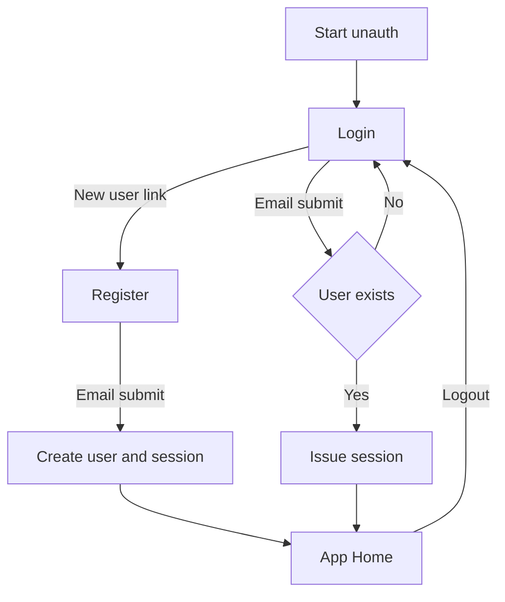

# Registration/Login Placeholder Plan (Email-Only)

## Scope
- Minimal placeholder auth for early development.
- **Email-only** registration/login; **no password**, **no email verification** yet.
- This is temporary and will be replaced with secure auth.

## Data Model (Backend)
### User
- `id` (UUID or int)
- `email` (unique, normalized lowercase)
- `created_at`
- `last_login_at`
- `is_active`

### Session
- `id`
- `user_id`
- `token_hash` (store hash only)
- `created_at`
- `expires_at`
- `revoked_at`

### Session Cookie
- Opaque token stored in **HttpOnly** cookie
- `Secure` in prod, `SameSite=Lax`
- Short TTL for placeholder (e.g., 7 days)

## Backend API Contract (FastAPI)
### `POST /auth/register`
- Body: `{ "email": "user@example.com" }`
- Behavior: normalize email, create user if missing, issue session cookie
- Responses:
  - `201` user summary
  - `409` if email already exists

### `POST /auth/login`
- Body: `{ "email": "user@example.com" }`
- Behavior: if user exists, issue session cookie and return user
- Responses:
  - `200` user summary
  - `404` if user not found (prompt to register)

### `POST /auth/logout`
- Behavior: revoke current session and clear cookie
- Responses:
  - `204`

### `GET /auth/me`
- Behavior: return current user if session valid
- Responses:
  - `200` user summary
  - `401` if not authenticated

### Error Shape
- Use consistent problem-details style as in [agent-commands/code-review.md](agent-commands/code-review.md:25)

## Frontend UX Wireflow (No Visual Design)
### Screens
- Login
- Register
- App Home

### Routes
- `/login`
- `/register`
- `/app` (guarded)

### Flow
1. Unauthenticated user lands on **Login**.
2. Login screen links to **Register**.
3. Register submit -> create user + session -> redirect to **/app**.
4. Login submit -> if user exists -> redirect to **/app**.
5. Logout -> clear session -> redirect to **/login**.

### Validation
- Email required
- Basic email format

## Security Notes (Temporary Placeholder)
- **Risk:** impersonation possible (no proof of email ownership).
- **Risk:** session fixation if tokens not rotated.
- **Mitigations (minimal):** rate limiting, short session TTL, server-side revocation.

## Migration Path to Real Auth
- Add password or magic-link login.
- Email verification on registration.
- CSRF token for session endpoints.
- Session rotation and refresh, stronger audit logging.

## Mermaid Wireflow

